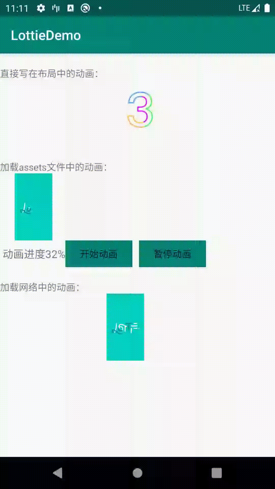
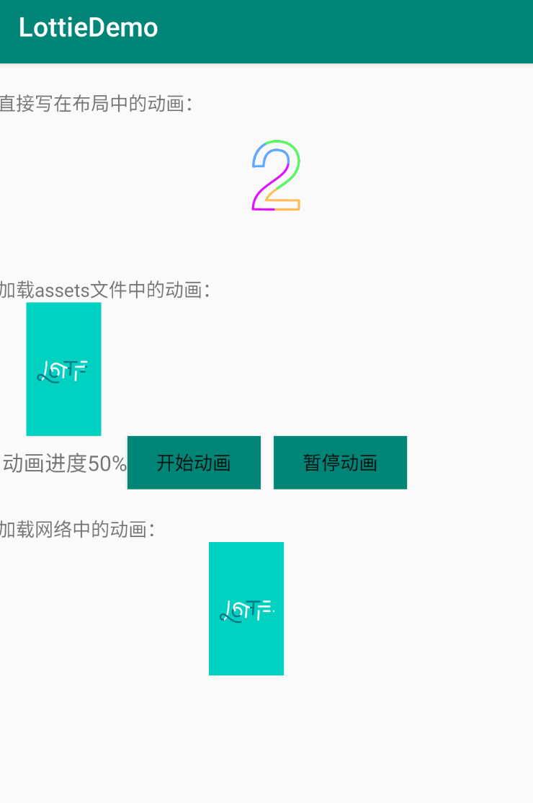

###Lottie是什么？
Lottie是Airbnb开源的一个支持 Android、iOS 以及 ReactNative，利用json文件的方式快速实现动画效果的库。这么看可能很难理解，接下来我将详细的讲解如何使用。
Lottie项目地址：[https://github.com/airbnb/lottie-android](https://github.com/airbnb/lottie-android)
***

# 自己写了一个demo,作为初学者的入门尝试：

#### 1、添加依赖和配置

* 工程根目录`build.gradle`文件添加如下配置：
```
allprojects {
    repositories {
        google()
        jcenter()
        
    }
}
```   

* APP目录buil.gradle文件添加如下配置：
```Java
    implementation 'com.airbnb.android:lottie:3.3.1'
    implementation 'com.squareup.okhttp3:okhttp:3.5.0'
```

#### 2、效果展示




#### 3、核心代码
##### activity
```Java
  private Button button1,button2;
    private TextView tv_seek;
    LottieAnimationView animation_view_assets;
    LottieAnimationView animation_view_net_get;
    private Bitmap image;

    @Override
    protected void onCreate(Bundle savedInstanceState) {
        super.onCreate(savedInstanceState);
        setContentView(R.layout.activity_main);

        initView();


    }

    private void initView() {
        animation_view_assets =(LottieAnimationView)findViewById(R.id.animation_view_asset_get);
        animation_view_assets.setAnimation("imagess/LottieLogo1.json");
        animation_view_assets.loop(true);
        animation_view_assets.buildDrawingCache();          //强制缓存绘制数据

        animation_view_assets.playAnimation();
        animation_view_assets.addAnimatorUpdateListener(new ValueAnimator.AnimatorUpdateListener() {
            @Override
            public void onAnimationUpdate(ValueAnimator animation) {
                tv_seek.setText(" 动画进度" +(int) (animation.getAnimatedFraction()*100) +"%");

                if((int) (animation.getAnimatedFraction()*100)==80){
                    image = animation_view_assets.getDrawingCache(); //获取当前绘制数据
                    if (image != null) {
                    }
                }
            }
        });


        tv_seek=(TextView)findViewById(R.id.tv_seek);

        button1=(Button)findViewById(R.id.button1);
        button2=(Button)findViewById(R.id.button2);

        button1.setOnClickListener(new View.OnClickListener() {
            @Override
            public void onClick(View view) {

                startAnima();
            }
        });
        button2.setOnClickListener(new View.OnClickListener() {
            @Override
            public void onClick(View view) {

                stopAnima();
            }
        });


        //网络图加载
        animation_view_net_get=(LottieAnimationView)findViewById(R.id.animation_view_net_get);
        loadUrl("https://assets6.lottiefiles.com/packages/lf20_IJ8lYj.json");


    }


    /*
     * 开始动画
     */
    private  void startAnima(){

        boolean inPlaying = animation_view_assets.isAnimating();
        if (!inPlaying) {
            animation_view_assets.setProgress(0);
            animation_view_assets.playAnimation();
        }
    }
    /*
     * 停止动画
     */
    private  void stopAnima(){
        boolean inPlaying = animation_view_assets.isAnimating();
        if (inPlaying) {
            animation_view_assets.pauseAnimation();
        }
    }


    private void loadUrl(String url) {
        Request request = new Request.Builder().url(url).build();
        OkHttpClient client = new OkHttpClient();
        client.newCall(request).enqueue(new Callback() {
            @Override public void onFailure(Call call, IOException e) {
                Log.i(TAG, "onFailure: ");
            }
            @Override public void onResponse(Call call, Response response) throws IOException {
                try {
                    JSONObject json = new JSONObject(response.body().string());
                    LottieComposition.Factory
                            .fromJsonString(json.toString(), new OnCompositionLoadedListener() {
                                @Override
                                public void onCompositionLoaded(LottieComposition composition) {
                                    animation_view_net_get.setComposition(composition);
                                    animation_view_net_get.playAnimation();
                                    animation_view_net_get.loop(true);
                                }
                            });
                } catch (JSONException e) {
                    e.printStackTrace();
                }
            }
        });
    }


    @Override
    protected void onStop() {
        super.onStop();
        animation_view_assets.cancelAnimation();
    }
}
    

```

##### xml
    

```
 <TextView
        android:layout_width="wrap_content"
        android:layout_height="wrap_content"
        android:layout_marginTop="20dp"
        android:text="直接写在布局中的动画："/>
    <com.airbnb.lottie.LottieAnimationView
        android:id="@+id/animation_view"
        android:layout_width="match_parent"
        android:layout_height="100dp"
        app:lottie_fileName="data.json"
        app:lottie_loop="true"
        app:lottie_autoPlay="true"/>

    <TextView
        android:layout_width="wrap_content"
        android:layout_height="wrap_content"
        android:layout_marginTop="20dp"
        android:text="加载assets文件中的动画："/>
    <com.airbnb.lottie.LottieAnimationView
        android:id="@+id/animation_view_asset_get"
        android:layout_width="100dp"
        android:layout_height="100dp"/>


    <LinearLayout
        android:layout_width="wrap_content"
        android:layout_height="wrap_content"
        android:orientation="horizontal">

        <TextView
            android:layout_width="wrap_content"
            android:layout_height="wrap_content"
            android:id="@+id/tv_seek"
            android:layout_gravity="center"
            android:textSize="16sp"
            />
        <Button
            android:layout_width="100dip"
            android:layout_height="40dip"
            android:text="开始动画"
            android:layout_gravity="center"
            android:background="@color/colorPrimary"
            android:id="@+id/button1"/>

        <Button
            android:layout_width="100dip"
            android:layout_height="40dip"
            android:layout_marginLeft="10dip"
            android:layout_gravity="center"
            android:text="暂停动画"
            android:background="@color/colorPrimary"
            android:id="@+id/button2"/>
    </LinearLayout>

    <TextView
        android:layout_width="wrap_content"
        android:layout_height="wrap_content"
        android:text="加载网络中的动画："
        android:layout_marginTop="20dp"/>
    <com.airbnb.lottie.LottieAnimationView
        android:id="@+id/animation_view_net_get"
        android:layout_width="wrap_content"
        android:layout_height="100dp"/>

```